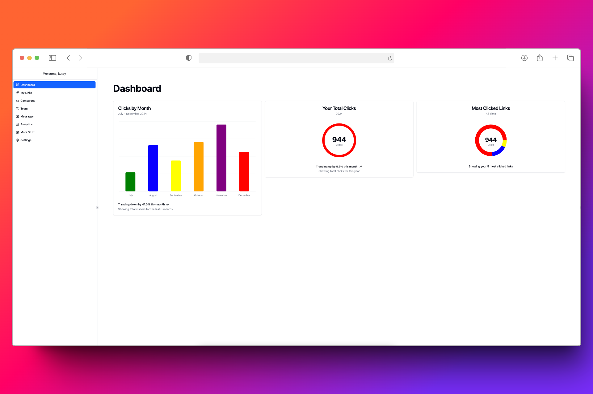

<h1>Thought Pocket</h1>

[Live](https://shortie.kutaybekleric.com)

<h3>A URL shortening service with analytics and real-time notifications</h3>

# Introduction

URL shortening service with analytics and real-time notifications. Using Golang's standard library for the backend and Next.js for the frontend. Used caching, sorting, and drag and drop features to enhance the user experience.

## Tech Stack

- Next.js
- Typescript
- Tanstack Query
- TailwindCSS
- shadcn/ui
- Recharts
- dnd-kit
- Golang
- PostgreSQL
- Redis
- Server Sent Events
- Docker

## Features

- <b>JWT Authentication</b>  

Saving the JWT as a HTTP only cookie.

- <b>Server Sent Events</b>  

When one of the links created by the logged in user is clicked, a notification is sent to the frontend then it is displayed as a toast.

- <b>Redis Caching</b>  

I kept the Redis logic simple, currentşy if a link is clicked more than _X_ amount of times it is saved in the redis to retrieve it faster since it is being clicked "a lot".

- <b>Resizable Sidebar</b>  

Sidebar can be resized and shrunk.

- <b>Drag and Drop</b>  

You can sort your analytic charts in the dashboard according to your preference, the order persists on local storage.
